import Admonition from '@theme/Admonition';

# Custom Serializers

:::note
This Guide is not suitable for beginners.  
Please only attempt this if you **really** know what you're doing!
:::

I haven't explained how a serializer really works in-depth yet, this is why I'm now going to go through the implementation of the [glaze serializer](https://github.com/saucer/saucer/tree/686382cf553345da6b1b8e0dc8f3ab4fd3b95c21/include/saucer/serializers/glaze) step by step.

This chapter only gives a pretty rough overview of how to implement your own serializer, if you have problems implementing your serializer feel free to reach out to me on [Discord](https://discord.gg/ndhmQE4225) or [GitHub](https://github.com/saucer/saucer).

## Illustration

In the following paragraphs I'll try to explain the inner workings of what exactly happens on function invocation and javascript code evaluation.
Aplogies for the slight mess ahead 😅

### Invocation of Exposed Function

```mermaid
flowchart TB
    classDef red stroke: red

    subgraph JavaScript
        JS[JavaScript]-->call["saucer.call(...)"]-.->Promise-.->pr["resolve"]
    end

    subgraph SmartView
        call--Serialized Data-->om
        om["smartview::on_message(...)"]

        parse["serializer::parse(...)"]:::red
        om=="std::unique_ptr<‍function_data‍>"==>parse

        expose["smartview::expose(...)"]-.->serialize["serializer::serialize(...)"]:::red
        serialize-.->fn["std::function"]-.->op

        parse--"function_data &"-->op["operator(...)"]
        op==Serialized Result==>pr
    end
```



### Evaluation of JavaScript Code

```mermaid
flowchart LR
    classDef red stroke: red

    subgraph JavaScript
        JS[JavaScript]
    end

    subgraph SmartView
        us["User"]
        ev["smartview::evaluate(...)"]
        sa["serializer::serialize_args(...)"]:::red
        sr["serializer::resolve(...)"]:::red
        sf["std::function"]

        us-->ev
        ev--"C++ Arguments"-->sa--"Serialized Args"-->ev

        ev=="std::promise"==>sr.->sf

        om["smartview::on_message(...)"]

        ev=="JS Code"==>JS
        JS=="Evaluation Result"==>om==>sf

        sf--"resolves std::promise"-->om
        om=="resolved result"==>us
    end
```

## Understanding the Serializer

<Admonition type="caution" icon="🏗️" title="Under Construction">
  <p>Sorry, this page is still under construction!</p>
</Admonition>
