# Implementing a Custom Serializer

:::note
This Guide is not suitable for beginners.  
Please only attempt this if you know what you're doing!
:::

We haven't explained how a serializer really works in-depth yet, this is why we're now going to implement a custom serializer and explain each step.
The serializer will be built upon [yaml-cpp](https://github.com/jbeder/yaml-cpp/) and [js-yaml](https://github.com/nodeca/js-yaml).

This chapter only gives a pretty rough overview of how to implement your own serializer, if you have problems implementing your serializer feel free to reach out to us on [Discord](https://discord.gg/ndhmQE4225) or [GitHub](https://github.com/saucer/saucer).

## Illustration

In the following paragraphs I'll try to explain the inner workings of what exactly happens on function invocation and javascript code evaluation.
Aplogies for the slight mess ahead 😅

### Invocation of Exposed Function

```mermaid
flowchart TB
    classDef red stroke: red

    subgraph JavaScript
        JS[JavaScript]-->call["saucer.call(...)"]-.->Promise-.->pr["resolve"]
    end

    subgraph SmartView
        call--Serialized Data-->om
        om["smartview::on_message(...)"]
        resolve["smartview::resolve(...)"]

        parse["serializer::parse(...)"]:::red
        om--Serialized Data-->parse

        parse-."std::shared_ptr<‍function_data‍>".->om

        expose["smartview::expose(...)"]-.->serialize["serializer::serialize(...)"]:::red
        serialize-.->fn["std::function"]-.->op

        om=="std::shared_ptr<‍function_data‍>"==>resolve--"function_data &"-->op["operator(...)"]
        op-.Serialized Result.->resolve
        resolve==Serialized Result==>pr
    end
```



### Evaluation of JavaScript Code

```mermaid
flowchart LR
    classDef red stroke: red

    subgraph JavaScript
        JS[JavaScript]
    end

    subgraph SmartView
        eval["smartview::eval<‍T‍>(...)"];

        eval-.->fut;
        fut["std::future<‍T‍>"];

        sr["serializer::resolve(...)"]:::red
        sr-.->fun["std::function"];

        eval-->sr;
        sr-."std::function".->eval

        sa["serializer::serialize_args(...)"]:::red
        eval--Arguments-->sa
        sa-.Serialized Arguments.->eval

        eval==JavaScript-Code==>JS

        om["smartview::on_message(...)"]
        JS-.Serialized Result.->om

        p["serializer::parse(...)"]:::red
        om--Serialized Data-->p-."std::shared_ptr<‍result_data‍>".->om;

        om=="std::shared_ptr<‍result_data‍>"==>r["smartview::resolve(...)"]--Invokes-->fun;
        fun==Resolves==>fut;
    end
```



## Project Setup

Now that we have a rough overview of how the data exchange works, we'll setup a CMake project to implement our custom yaml serializer.
To do this we'll take the CMakeLists we've [previously used](../getting-started/basic-app) and modify it a little.

```cmake title="CMakeLists.txt"
cmake_minimum_required(VERSION 3.1)
project(saucer_guide LANGUAGES CXX VERSION 1.0)

# --------------------------------------------------------------------------------------------------------
# Create executable
# --------------------------------------------------------------------------------------------------------

add_executable(${PROJECT_NAME} "src/main.cpp")
target_compile_features(${PROJECT_NAME} PRIVATE cxx_std_17)
set_target_properties(${PROJECT_NAME} PROPERTIES CXX_STANDARD 17 CXX_EXTENSIONS OFF CXX_STANDARD_REQUIRED ON)

// green-start
# --------------------------------------------------------------------------------------------------------
# Include headers
# --------------------------------------------------------------------------------------------------------

target_include_directories(${PROJECT_NAME} PRIVATE "include")

// green-end
# --------------------------------------------------------------------------------------------------------
# Link libraries
# --------------------------------------------------------------------------------------------------------

include(FetchContent)

// green
FetchContent_Declare(yaml GIT_REPOSITORY "https://github.com/jbeder/yaml-cpp" GIT_TAG yaml-cpp-0.7.0) # yaml-cpp, so that we can work with yaml on the C++ side.
FetchContent_Declare(saucer GIT_REPOSITORY "https://github.com/saucer/saucer")
// green
FetchContent_Declare(cpr GIT_REPOSITORY "https://github.com/libcpr/cpr" GIT_TAG 1.9.3) # cpr, a curl wrapper, you'll see why we need this later on.
FetchContent_MakeAvailable(saucer yaml cpr)

// green
target_link_libraries(${PROJECT_NAME} PRIVATE saucer::saucer yaml-cpp::yaml-cpp cpr::cpr)
```

## Implementing the Serializer

First off, we'll create our serializer class in a header (`yaml.hpp`) and define the two most basic methods, `init_script` and `js_serializer`.

```cpp title="yaml.hpp"
#pragma once
#include <saucer/serializers/serializer.hpp>

namespace saucer
{
    namespace serializers
    {
        struct yaml : public serializer
        {
          public:
            ~yaml() override = default;

          public:
            [[nodiscard]] std::string init_script() const override;
            [[nodiscard]] std::string js_serializer() const override;
        };
    }
}
```

And we'll implement these two methods in a source file (`yaml.cpp`).  
A short description of what these two function do:

- `init_script`
  - Returns a `std::string`, which is injected into every web-page, you can use this to load javascript libraries required by your serializer.
- `js_serializer`
  - Returns a `std::string` which represents the function that the JavaScript code will use to serialize objects (i.e. `JSON.stringify`).

```cpp title="yaml.cpp"
#include "yaml.hpp"
#include <cpr/cpr.h>

namespace saucer::serializers
{
    std::string yaml::init_script() const
    {
        // highlight-start
        // Please don't do this in production! We're just doing this for illustration purposes.
        // We'll retrieve the code for js-yaml, so that we can properly use `jsyaml.dump` on every web-page.
        const auto yaml_js = cpr::Get(cpr::Url{"https://raw.githubusercontent.com/nodeca/js-yaml/master/dist/js-yaml.js"});
        // highlight-end
        return yaml_js.text;
    }

    std::string yaml::js_serializer() const
    {
        // highlight-start
        // The function used to serialize objects on the javascript side (e.g. JSON.stringify)
        return "jsyaml.dump";
        // highlight-end
    }
}
```

No we'll define our custom `data` structures. There are two types of `data` structures:

- `result_data`

  - Carries the result of evaluated javascript code

- `function_data`

  - Carries the information for the invocation of an exposed function

In our case both should carry a parsed YAML-Node for simplicity sake, in case you don't understand why we'd want to carry a YAML Node, please read on, it might make more sense later on.

```cpp title="yaml.hpp"
// green
#include <yaml-cpp/yaml.h>

namespace saucer
{
    namespace serializers
    {
        // green-start
        struct yaml_function_data : public function_data
        {
            YAML::Node data;
            // highlight-start
            ~yaml_function_data() override = default; // The destructor should always be overloaded.
            // highlight-end
        };

        struct yaml_result_data : public result_data
        {
            YAML::Node data;
            ~yaml_result_data() override = default;
        };
        // green-end

        // ...
    }
}
```

Alright, now we'll get to the more complicated stuff.

I'll now implement the `parse` method.  
Before we jump right into the code, there's something you should know about how the internal messages are structured.

The JavaScript method used to invoke native functions (`saucer.call`), is roughly implemented like the following:

```ts title="Possible Implementation"
function call(name: string, params: any[]) {
  // ...
  // highlight-start
  await send_native_message(
    serialize({
      name,
      params,
      id: ++some_counter,
    })
  );
  // highlight-end
  // ...
}
```

Why would we want to know this?
Well, this is crucial to know when we implement the `parse` method,
as we want to know if the message we received is the request for a function invocation or the result for an `eval()` call <sup><sub>([compare Illustration](#illustration))</sub></sup>.

So with that knowledge gained, let's jump into the C++ code!

```cpp title="yaml.hpp"
#pragma once
#include <saucer/serializers/serializer.hpp>

namespace saucer
{
    namespace serializers
    {
        // ...

        struct yaml : public serializer
        {
          public:
            ~yaml() override = default;

          public:
            [[nodiscard]] std::string init_script() const override;
            [[nodiscard]] std::string js_serializer() const override;
          // green-start

          public:
            [[nodiscard]] std::unique_ptr<message_data> parse(const std::string &data) const override;
          // green-end
        };
    }
}
```

```cpp title="yaml.cpp"
namespace saucer
{
    namespace serializers
    {
        // ...
        // green-start
        std::unique_ptr<message_data> yaml::parse(const std::string &data) const
        {
            // highlight-start
            try // We need to use try catch, as yaml-cpp does not have a `TryLoad` method (as far as I'm aware of)
            // highlight-end
            {
                auto yaml = YAML::Load(data); // Parse the string we received

            // highlight-start
                if (!yaml["id"].IsDefined())
                {
                    // `id` should be defined in a function invocation request
                    // as well as in a evaulation result message
                    return nullptr;
                }
            // highlight-end

            // highlight-start
                // As you may remember, `saucer.call` always passes the `params` as an array and also
                // supplies the name of the function we want to call.
                if (yaml["params"].IsSequence() && yaml["name"].IsDefined())
                {
                    auto rtn = std::make_unique<yaml_function_data>();

                    rtn->data = yaml["params"]; // We copy the params node, as we'll need it later on.
                    rtn->id = yaml["id"].as<std::size_t>();
                    rtn->function = yaml["name"].as<std::string>();

                    return rtn;
                }
            // highlight-end
            }
            catch (...)
            {
            }

            return nullptr;
        }
        // green-end
    }
}
```

Now our `parse` method is able to properly parse function invocation requests.

Let's take a look at what happens when we call `eval()`.  
If you glance at the [illustration](#illustration), you'll see that `smartview::eval(...)` will eventually send some Code to JavaScript.

This code in questions roughly equals the following:

```ts title="Possible Implementation"
// highlight-start
window.saucer.resolve(_some_id, _result);
// highlight-end

// With resolve being defined as:
function resolve(id: string, result: any) {
  // ...
  // highlight-start
  await send_native_message(
    serialize({
      id,
      result,
    })
  );
  // highlight-end
  // ...
}
```

With that in mind we'll expand our `parse` method.

```cpp title="yaml.cpp"
namespace saucer
{
    namespace serializers
    {
        // ...
        std::unique_ptr<message_data> yaml::parse(const std::string &data) const
        {
            try
            {
                //...
                // green-start
                if (yaml["result"].IsDefined())
                {
                    auto rtn = std::make_unique<yaml_result_data>();

                    rtn->data = yaml["result"]; // We copy the result node, as we'll need it later to resolve the `std::future`
                    rtn->id = yaml["id"].as<std::size_t>();

                    return rtn;
                }
                // green-end
            }
            catch (...)
            {
            }
            return nullptr;
        }
    }
}
```

Ok, now we have a complete implementation for our `parse` method, next up on the list is `serialize()`.
Continue by adding `serialize` to the `yaml` struct, we'll then go ahead and implement said function in another header `yaml.inl`.

```cpp title="yaml.hpp"
#pragma once
#include <saucer/serializers/serializer.hpp>

namespace saucer
{
    namespace serializers
    {
        struct yaml_function_data : public function_data
        {
            YAML::Node data;
            ~yaml_function_data() override = default;
        };

        struct yaml_result_data : public result_data
        {
            YAML::Node data;
            ~yaml_result_data() override = default;
        };

        struct yaml : public serializer
        {
          public:
            ~yaml() override = default;

          public:
            [[nodiscard]] std::string init_script() const override;
            [[nodiscard]] std::string js_serializer() const override;

          public:
            [[nodiscard]] std::unique_ptr<message_data> parse(const std::string &data) const override;
          // green-start

          public:
            template <typename Function> static auto serialize(const Function &func);
          // green-end
        };
    }
}
```
