# Implementing a Custom Serializer

:::note
This Guide is not suitable for beginners.  
Please only attempt this if you know what you're doing!
:::

We haven't explained how a serializer really works in-depth yet, this is why we're now going to implement a custom serializer and explain each step.
The serializer will be built upon [yaml-cpp](https://github.com/jbeder/yaml-cpp/) and [js-yaml](https://github.com/nodeca/js-yaml).

This chapter only gives a pretty rough overview of how to implement your own serializer, if you have problems implementing your serializer feel free to reach out to us on [Discord](https://discord.gg/ndhmQE4225) or [GitHub](https://github.com/saucer/saucer).

## Illustration

In the following paragraphs I'll try to explain the inner workings of what exactly happens on function invocation and javascript code evaluation.
Aplogies for the slight mess ahead 😅

### Invocation of Exposed Function

```mermaid
flowchart TB
    classDef red stroke: red

    subgraph JavaScript
        JS[JavaScript]-->call["saucer.call(...)"]-.->Promise-.->pr["resolve"]
    end

    subgraph SmartView
        call--Serialized Data-->om
        om["smartview::on_message(...)"]
        resolve["smartview::resolve(...)"]

        parse["serializer::parse(...)"]:::red
        om--Serialized Data-->parse

        parse-."std::shared_ptr<‍function_data‍>".->om

        expose["smartview::expose(...)"]-.->serialize["serializer::serialize(...)"]:::red
        serialize-.->fn["std::function"]-.->op

        om=="std::shared_ptr<‍function_data‍>"==>resolve--"function_data &"-->op["operator(...)"]
        op-.Serialized Result.->resolve
        resolve==Serialized Result==>pr
    end
```



### Evaluation of JavaScript Code

```mermaid
flowchart LR
    classDef red stroke: red

    subgraph JavaScript
        JS[JavaScript]
    end

    subgraph SmartView
        eval["smartview::eval<‍T‍>(...)"];

        eval-.->fut;
        fut["std::future<‍T‍>"];

        sr["serializer::resolve(...)"]:::red
        sr-.->fun["std::function"];

        eval-->sr;
        sr-."std::function".->eval

        sa["serializer::serialize_args(...)"]:::red
        eval--Arguments-->sa
        sa-.Serialized Arguments.->eval

        eval==JavaScript-Code==>JS

        om["smartview::on_message(...)"]
        JS-.Serialized Result.->om

        p["serializer::parse(...)"]:::red
        om--Serialized Data-->p-."std::shared_ptr<‍result_data‍>".->om;

        om=="std::shared_ptr<‍result_data‍>"==>r["smartview::resolve(...)"]--Invokes-->fun;
        fun==Resolves==>fut;
    end
```



## Project Setup

Now that we have a rough overview of how the data exchange works, we'll setup a CMake project to implement our custom yaml serializer.
To do this we'll take the CMakeLists we've [previously used](../getting-started/basic-app) and modify it a little.

```cmake title="CMakeLists.txt"
cmake_minimum_required(VERSION 3.1)
project(saucer_guide LANGUAGES CXX VERSION 1.0)

# --------------------------------------------------------------------------------------------------------
# Create executable
# --------------------------------------------------------------------------------------------------------

add_executable(${PROJECT_NAME} "src/main.cpp")
target_compile_features(${PROJECT_NAME} PRIVATE cxx_std_20)
set_target_properties(${PROJECT_NAME} PROPERTIES CXX_STANDARD 20 CXX_EXTENSIONS OFF CXX_STANDARD_REQUIRED ON)

// green-start
# --------------------------------------------------------------------------------------------------------
# Include headers
# --------------------------------------------------------------------------------------------------------

target_include_directories(${PROJECT_NAME} PRIVATE "include")

// green-end
# --------------------------------------------------------------------------------------------------------
# Link libraries
# --------------------------------------------------------------------------------------------------------

include(FetchContent)

// green
FetchContent_Declare(yaml GIT_REPOSITORY "https://github.com/jbeder/yaml-cpp" GIT_TAG yaml-cpp-0.7.0) # yaml-cpp, so that we can work with yaml on the C++ side.
FetchContent_Declare(saucer GIT_REPOSITORY "https://github.com/saucer/saucer" GIT_TAG experimental)
// green
FetchContent_Declare(cpr GIT_REPOSITORY "https://github.com/libcpr/cpr" GIT_TAG 1.9.3) # cpr, a curl wrapper, you'll see why we need this later on.
FetchContent_MakeAvailable(saucer yaml cpr)

// green
target_link_libraries(${PROJECT_NAME} PRIVATE saucer::saucer yaml-cpp::yaml-cpp cpr::cpr)
```

## Implementing the Serializer

First off, we'll create our serializer class in a header (`yaml.hpp`) and define the two most basic methods, `script` and `js_serializer`.

```cpp title="yaml.hpp"
#pragma once
#include <saucer/serializers/serializer.hpp>

namespace saucer
{
    namespace serializers
    {
        struct yaml : public serializer
        {
          public:
            ~yaml() override = default;

          public:
            [[nodiscard]] std::string script() const override;
            [[nodiscard]] std::string js_serializer() const override;
        };
    }
}
```

And we'll implement these two methods in a source file (`yaml.cpp`).  
A short description of what these two function do:

- `script`
  - Returns a `std::string`, which is injected into every web-page, you can use this to load javascript libraries required by your serializer.
- `js_serializer`
  - Returns a `std::string` which represents the function that the JavaScript code will use to serialize objects (i.e. `JSON.stringify`).

```cpp title="yaml.cpp"
#include "yaml.hpp"
#include <cpr/cpr.h>

namespace saucer::serializers
{
    std::string yaml::script() const
    {
        // highlight-start
        // Please don't do this in production! We're just doing this for illustration purposes.
        // We'll retrieve the code for js-yaml, so that we can properly use `jsyaml.dump` on every web-page.
        const auto yaml_js = cpr::Get(cpr::Url{"https://raw.githubusercontent.com/nodeca/js-yaml/master/dist/js-yaml.js"});
        // highlight-end
        return yaml_js.text;
    }

    std::string yaml::js_serializer() const
    {
        // highlight-start
        // The function used to serialize objects on the javascript side (e.g. JSON.stringify)
        return "jsyaml.dump";
        // highlight-end
    }
}
```

No we'll define our custom `data` structures. There are two types of `data` structures:

- `result_data`

  - Carries the result of evaluated javascript code

- `function_data`

  - Carries the information for the invocation of an exposed function

In our case both should carry a parsed YAML-Node for simplicity sake, in case you don't understand why we'd want to carry a YAML Node, please read on, it might make more sense later on.

```cpp title="yaml.hpp"
// green
#include <yaml-cpp/yaml.h>

namespace saucer
{
    namespace serializers
    {
        // green-start
        struct yaml_function_data : public function_data
        {
            YAML::Node data;
            // highlight-start
            ~yaml_function_data() override = default; // The destructor should always be overloaded.
            // highlight-end
        };

        struct yaml_result_data : public result_data
        {
            YAML::Node data;
            ~yaml_result_data() override = default;
        };
        // green-end

        // ...
    }
}
```

Alright, now we'll get to the more complicated stuff.

I'll now implement the `parse` method.  
Before we jump right into the code, there's something you should know about how the internal messages are structured.

The JavaScript method used to invoke native functions (`saucer.call`), is roughly implemented like the following:

```ts title="Possible Implementation"
function call(name: string, params: any[]) {
  // ...
  // highlight-start
  await send_native_message(
    serialize({
      name,
      params,
      id: ++some_counter,
    })
  );
  // highlight-end
  // ...
}
```

Why would we want to know this?
Well, this is crucial to know when we implement the `parse` method,
as we want to know if the message we received is the request for a function invocation or the result for an `eval()` call <sup><sub>([compare Illustration](#illustration))</sub></sup>.

So with that knowledge gained, let's jump into the C++ code!

```cpp title="yaml.hpp"
#pragma once
#include <saucer/serializers/serializer.hpp>

namespace saucer
{
    namespace serializers
    {
        // ...

        struct yaml : public serializer
        {
          public:
            ~yaml() override = default;

          public:
            [[nodiscard]] std::string init_script() const override;
            [[nodiscard]] std::string js_serializer() const override;
          // green-start

          public:
            [[nodiscard]] std::unique_ptr<message_data> parse(const std::string &data) const override;
          // green-end
        };
    }
}
```

```cpp title="yaml.cpp"
namespace saucer
{
    namespace serializers
    {
        // ...
        // green-start
        std::unique_ptr<message_data> yaml::parse(const std::string &data) const
        {
            // highlight-start
            try // We need to use try catch, as yaml-cpp does not have a `TryLoad` method (as far as I'm aware of)
            // highlight-end
            {
                auto yaml = YAML::Load(data); // Parse the string we received

            // highlight-start
                if (!yaml["id"].IsDefined())
                {
                    // `id` should be defined in a function invocation request
                    // as well as in a evaulation result message
                    return nullptr;
                }
            // highlight-end

            // highlight-start
                // As you may remember, `saucer.call` always passes the `params` as an array and also
                // supplies the name of the function we want to call.
                if (yaml["params"].IsSequence() && yaml["name"].IsDefined())
                {
                    auto rtn = std::make_unique<yaml_function_data>();

                    rtn->data = yaml["params"]; // We copy the params node, as we'll need it later on.
                    rtn->id = yaml["id"].as<std::size_t>();
                    rtn->function = yaml["name"].as<std::string>();

                    return rtn;
                }
            // highlight-end
            }
            catch (...)
            {
            }

            return nullptr;
        }
        // green-end
    }
}
```

Now our `parse` method is able to properly parse function invocation requests.

Let's take a look at what happens when we call `eval()`.  
If you glance at the [illustration](#illustration), you'll see that `smartview::eval(...)` will eventually send some Code to JavaScript.

The code in questions roughly equals the following:

```ts title="Possible Implementation"
// highlight-start
window.saucer.resolve(_some_id, _result);
// highlight-end

// With resolve being defined as:
function resolve(id: string, result: any) {
  // ...
  // highlight-start
  await send_native_message(
    serialize({
      id,
      result,
    })
  );
  // highlight-end
  // ...
}
```

With that in mind we'll expand our `parse` method.

```cpp title="yaml.cpp"
namespace saucer
{
    namespace serializers
    {
        // ...
        std::unique_ptr<message_data> yaml::parse(const std::string &data) const
        {
            try
            {
                //...
                // green-start
                if (yaml["result"].IsDefined())
                {
                    auto rtn = std::make_unique<yaml_result_data>();

                    rtn->data = yaml["result"]; // We copy the result node, as we'll need it later to resolve the `std::promise`
                    rtn->id = yaml["id"].as<std::size_t>();

                    return rtn;
                }
                // green-end
            }
            catch (...)
            {
            }
            return nullptr;
        }
    }
}
```

Ok, now we have a complete implementation for our `parse` method, next up on the list is `serialize()`.
Continue by adding `serialize` to the `yaml` struct, we'll then go ahead and implement said function in another header `yaml.inl`.

```cpp title="yaml.hpp"
#pragma once
#include <saucer/serializers/serializer.hpp>

namespace saucer
{
    namespace serializers
    {
        struct yaml_function_data : public function_data
        {
            YAML::Node data;
            ~yaml_function_data() override = default;
        };

        struct yaml_result_data : public result_data
        {
            YAML::Node data;
            ~yaml_result_data() override = default;
        };

        struct yaml : public serializer
        {
          public:
            ~yaml() override = default;

          public:
            [[nodiscard]] std::string init_script() const override;
            [[nodiscard]] std::string js_serializer() const override;

          public:
            [[nodiscard]] std::unique_ptr<message_data> parse(const std::string &data) const override;
          // green-start

          public:
            template <typename Function> static auto serialize(const Function &func);
          // green-end
        };
    }
}
```

Alright, now it's going to get a little bit complicated.

The `serialize()` method takes a `Function`, to which we'll need to construct a `std::function` which takes a `YAML::Node` and then correctly parses said node into function arguments that we'll use to invoke the function we received in `serialize()`.

So the first thing we'll need is the types of the `Function`s arguments, to get those we'll use `boost::callable_traits`, which saucer already publicly links agsint, which means - as long as you consume saucer through CMake - you wont need to care about that dependency yourself.

```cpp title="yaml.inl"
#pragma once
#include "yaml.hpp"
#include <boost/callable_traits.hpp>

namespace saucer::serializers
{
  // green-start
  template <typename Function> auto yaml::serialize(const Function &func)
  {
      using raw_args_t = boost::callable_traits::args_t<Function>;
  }
  // green-end
}
```

There's still something we haven't thought about, namely: The Arguments the function takes may be (const) references.  
What `callable_args_t` gives us is a tuple consisting of the functions arguments, and we want to parse values from the `YAML::Node` into said tuple.

However if one of the functions arguments is a said (const) reference as mentioned earlier, this is obviously not going to work properly.
So we'll need to remove all (const) references from each tuple item.

```cpp title="yaml.inl"
#pragma once
#include "yaml.hpp"
#include <boost/callable_traits.hpp>

namespace saucer::serializers
{
  // green-start
  template <typename T> struct decay_tuple
  {
  };

  template <typename... T> struct decay_tuple<std::tuple<T...>>
  {
      using type = std::tuple<std::decay_t<T>...>;
  };

  template <typename T> using decay_tuple_t = typename decay_tuple<T>::type;
  // green-end

  template <typename Function> auto yaml::serialize(const Function &func)
  {
      using raw_args_t = boost::callable_traits::args_t<Function>;
  // green-start
      using args_t = decay_tuple_t<raw_args_t>;
  // green-end
  }
}
```

Now, we'll start implementing the `std::function` which actually invokes the function we got in the `serialize` call.

```cpp title="yaml.cpp"
#pragma once
#include "yaml.hpp"
#include <boost/callable_traits.hpp>

namespace saucer::serializers
{
  // ...
  template <typename Function> auto yaml::serialize(const Function &func)
  {
      using raw_args_t = boost::callable_traits::args_t<Function>;
      using args_t = decay_tuple_t<raw_args_t>;

  // green-start
     return [func](function_data &data) -> function_serializer::result_type {
        auto &message = dynamic_cast<yaml_function_data &>(data);
        const auto &params = message.data; // This is the YAML-Node we saved in the function data earlier!
     };
  // green-end
  }
}
```

We'll now do some sanity checks.

```cpp title="yaml.cpp"
#pragma once
#include "yaml.hpp"
#include <boost/callable_traits.hpp>

namespace saucer::serializers
{
  // ...
  template <typename Function> auto yaml::serialize(const Function &func)
  {
      using raw_args_t = boost::callable_traits::args_t<Function>;
      using args_t = decay_tuple_t<raw_args_t>;

     return [func](function_data &data) -> function_serializer::result_type {
        auto &message = dynamic_cast<yaml_function_data &>(data);
        const auto &params = message.data;

  // green-start
        if (params.size() != std::tuple_size_v<args_t>)
        {
            return tl::make_unexpected(serializer_error::argument_count_mismatch);
        }
  // green-end
     };
  }
}
```

And now we'll deserialize the function arguments (the second parameter to `saucer.call`).  
The YAML-Node we saved earlier is just an array, that we need to deserialize into a tuple which we can later use with `std::apply` to call our native function.

```cpp title="yaml.cpp"
#pragma once
#include "yaml.hpp"
#include <boost/callable_traits.hpp>

namespace saucer::serializers
{
  // ...
  template <typename Function> auto yaml::serialize(const Function &func)
  {
      using raw_args_t = boost::callable_traits::args_t<Function>;
      using args_t = decay_tuple_t<raw_args_t>;

     return [func](function_data &data) -> function_serializer::result_type {
        auto &message = dynamic_cast<yaml_function_data &>(data);
        const auto &params = message.data;

        if (params.size() != std::tuple_size_v<args_t>)
        {
            return tl::make_unexpected(serializer_error::argument_count_mismatch);
        }

  // green-start
        args_t args;

        try
        {
            std::size_t current_arg{0};

            auto serialize_item = [&]<typename T>(T &arg) {
                auto current = params[current_arg++].as<std::decay_t<arg_t>>();
                arg = static_cast<std::decay_t<arg_t>>(current);
            };

            std::apply([&](auto &...args) { (serialize_item(args), ...); }, args);
        }
        catch (...)
        {
            // In case static_cast<arg_t> fails for some argument we throw a type mismatch
            return tl::make_unexpected(error::type_mismatch);
        }
  // green-end
     };
  }
}
```

Now that we have all our arguments parsed, we're ready to call the actual native function _(i.e. the function we got passed in the `serialize` / `expose` call)_.

```cpp title="yaml.cpp"
#pragma once
#include "yaml.hpp"
#include <boost/callable_traits.hpp>

namespace saucer::serializers
{
    // ...
    template <typename Function> auto yaml::serialize(const Function &func)
    {
        using raw_args_t = boost::callable_traits::args_t<Function>;

        using rtn_t = boost::callable_traits::return_type_t<Function>;
        using args_t = detail::yaml::decay_tuple_t<raw_args_t>;

        return [func](function_data &data) -> function_serializer::result_type {
            auto &message = dynamic_cast<yaml_function_data &>(data);
            const auto &params = message.data;

            if (params.size() != std::tuple_size_v<args_t>)
            {
                return tl::make_unexpected(serializer_error::argument_count_mismatch);
            }

            args_t args;

            try
            {
                std::size_t current_arg{0};

                auto serialize_item = [&]<typename T>(T &arg) {
                    auto current = params[current_arg++].as<std::decay_t<T>>();
                    arg = static_cast<std::decay_t<T>>(current);
                };

                std::apply([&](auto &...args) { (serialize_item(args), ...); }, args);
            }
            catch (...)
            {
                return tl::make_unexpected(serializer_error::type_mismatch);
            }

// green-start
            YAML::Node rtn;

            // We call the native function with the arguments we parsed earlier using `std::apply`
            if constexpr (std::is_void_v<rtn_t>)
            {
                // In case the return type is void, we don't actually need to serialize anything.
                std::apply(func, args);
            }
            else
            {
                rtn = std::apply(func, args);
            }

            // We serialize the return value to yaml
            auto dump = YAML::Dump(rtn);
            dump = std::regex_replace(dump, std::regex("`"), "\\u0060");

            // We return javascript code that de-serializes our result
            return fmt::format("jsyaml.load(`{}`)", dump);
// green-end
        };
    }
}
```

Now that's the most complicated part done!

---

Since the implementation of `serialize_args` will be roughly the same I won't go in too much detail here, however I'll just give you a quick overview of what the function does and leave some comments in the code.

:::info
The function `serialize_args` is used when you call `eval` with additional arguments, for example the following snippet:

```cpp
webview.eval<double>("Math.pow({}, {})", 10, 20) | saucer::then([](double result) {
  // Do something with result
});
```

Will call `serialize_args` with `10, 20` as parameters.
:::

The task of `serialize_args` is to simply convert the parameters passed to it into a `fmt::dynamic_format_arg_store` of expressions that evaluate to the same object in JavasSript.

There is however one special case that needs to be handeled here: `saucer::arguments` (see [`saucer::make_args`](../getting-started/interoperability#calling-javascript)).
Under the hood `saucer::arguments` are just a plain old `std::tuple`, however we don't want to serialize them as a tuple but as function arguments instead.

To quickly illustrate what is meant by "function arguments":

import CodeBlock from '@theme/CodeBlock';

<table>
  <tr>
    <th>Input</th>
    <th>Output (Result of serialize_args)</th>
  </tr>
  <tr>
    <td>
      <CodeBlock language="cpp">{'std::tuple{10, 20}'}</CodeBlock>
    </td>
    <td>
      <CodeBlock language="js">JSON.parse("[10, 20]")</CodeBlock>
    </td>
  </tr>
  <tr>
    <td>
      <CodeBlock language="cpp">{'saucer::arguments{10, 20}'}</CodeBlock>
    </td>
    <td>
      <CodeBlock language="js">JSON.parse("10"), JSON.parse("20")</CodeBlock>
    </td>
  </tr>
</table>

> The example shown above uses JSON instead of YAML to simplify the illustration

```cpp title="yaml.hpp"
#pragma once
#include <saucer/serializers/serializer.hpp>

namespace saucer
{
    namespace serializers
    {
        struct yaml_function_data : public function_data
        {
            YAML::Node data;
            ~yaml_function_data() override = default;
        };

        struct yaml_result_data : public result_data
        {
            YAML::Node data;
            ~yaml_result_data() override = default;
        };

        struct yaml : public serializer
        {
          public:
            ~yaml() override = default;

          public:
            [[nodiscard]] std::string init_script() const override;
            [[nodiscard]] std::string js_serializer() const override;

          public:
            [[nodiscard]] std::unique_ptr<message_data> parse(const std::string &data) const override;

          public:
            template <typename Function> static auto serialize(const Function &func);
          // green-start
            template <typename... Params> static auto serialize_args(const Params &...params);
          // green-end
        };
    }
}
```

```cpp title="yaml.cpp"
#pragma once
#include "yaml.hpp"
#include <boost/callable_traits.hpp>

namespace saucer::serializers
{
    // ...
    template <typename... Params> auto yaml::serialize_args(const Params &...params)
    {
        fmt::dynamic_format_arg_store<fmt::format_context> rtn;

        auto unpack = [&](const auto &arg) {
            using arg_t = std::decay_t<decltype(arg)>;

            if constexpr (is_arguments<arg_t>)
            {
                // Special case for `saucer::arguments`

                std::string rtn;
                auto tuple = static_cast<typename arg_t::tuple_t>(arg);

                auto serialize_item = [&](const auto &item) {
                    YAML::Node node;
                    node["result"] = item;

                    std::stringstream yaml;
                    yaml << node;

                    rtn += fmt::format("jsyaml.load(`{}`).result,", yaml.str());
                };

                std::apply([&](const auto &...arg) { (serialize_item(arg), ...); }, tuple);

                if (!rtn.empty())
                {
                    // Remove trailing comma
                    rtn.pop_back();
                }

                return rtn;
            }
            else
            {
                // Simply serialize the input

                YAML::Node node;
                node["result"] = arg;

                std::stringstream yaml;
                yaml << node;

                auto res = fmt::format("jsyaml.load(`{}`).result", yaml.str());
                return res;
            }
        };

        // Serialize each variadic parameter and add them to the dynamic_format_arg_store
        (rtn.push_back(unpack(params)), ...);

        return rtn;
    }
}
```

---

The last method we need to implement is `resolve`.

This function takes a pointer to a `std::promise` and returns a function which takes `result_data` and then simply resolves the promise with the de-serialized data.  
The code for this is also pretty self-explainatory, so I'll just go ahead and show what it looks like.

```cpp title="yaml.hpp"
#pragma once
#include <saucer/serializers/serializer.hpp>

namespace saucer
{
    namespace serializers
    {
        struct yaml_function_data : public function_data
        {
            YAML::Node data;
            ~yaml_function_data() override = default;
        };

        struct yaml_result_data : public result_data
        {
            YAML::Node data;
            ~yaml_result_data() override = default;
        };

        struct yaml : public serializer
        {
          public:
            ~yaml() override = default;

          public:
            [[nodiscard]] std::string init_script() const override;
            [[nodiscard]] std::string js_serializer() const override;

          public:
            [[nodiscard]] std::unique_ptr<message_data> parse(const std::string &data) const override;

          public:
            template <typename Function> static auto serialize(const Function &func);
            template <typename... Params> static auto serialize_args(const Params &...params);

          // green-start
          public:
            template <typename T> static auto resolve(std::shared_ptr<std::promise<T>> promise);
          // green-end
        };
    }
}
```

```cpp title="yaml.cpp"
#pragma once
#include "yaml.hpp"
#include <boost/callable_traits.hpp>

namespace saucer::serializers
{
    // ...
    template <typename T> auto yaml::resolve(std::shared_ptr<std::promise<T>> promise)
    {
        return [promise = std::move(promise)](result_data &data) mutable {
            auto &yaml_data = dynamic_cast<yaml_result_data &>(data);

            if constexpr (std::is_same_v<T, void>)
            {
                promise->set_value();
            }
            else
            {
                try
                {
                    promise->set_value(yaml_data.data.as<T>());
                }
                catch (...)
                {
                    promise->set_exception(std::current_exception());
                }
            }
        };
    }
}
```
